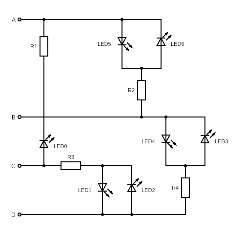

# Circuit diagram

Below is a schematic diagram of the circuit for the charlieplexed LEDs. With four pins a maximum of 12 LEDs could be controlled, but this tree only uses 7.

Charlieplexing takes advantage of pins on things like the Raspberry Pi having three possible states: output high, output low and input. The input state effectively disconnects the pin from the rest of the circuit.

The pin settings for each LED are:
H: High
L: Low
U: Unconnected (input)

| A | B | C | D | LED |
|---|---|---|---|-----|
| H | L | U | U | 5   |
| L | H | U | U | 6   |
| L | U | H | U | 0   |
| U | H | U | L | 4   |
| U | L | U | H | 3   |
| U | U | H | L | 1   |
| U | U | L | H | 2   |

# Pin layout

There are six pins, four are used. 

    X  C  B
    A  D  X
    
*Physical pin numbers* With a 40 pin header:
    
    39 37 35
    40 38 36
    
*Physical pin numbers* with a 26 pin header:

    25 23 21
    26 24 22
    
Mounts on the pins furthest from the corner - physical pins 21-26 on the model A or B and 35-40 on models with 40 pins

# How to use

Only one LED can be lit at once, so the code relies on flashing them in turn quickly so that it looks like more than one is on.
